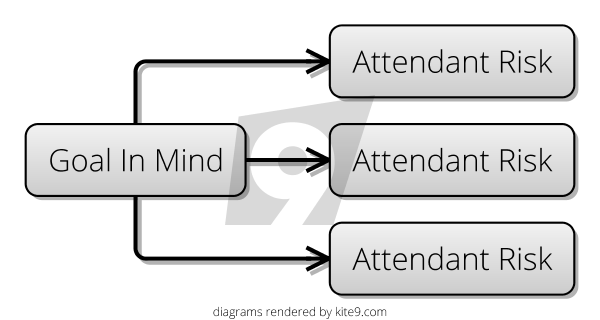
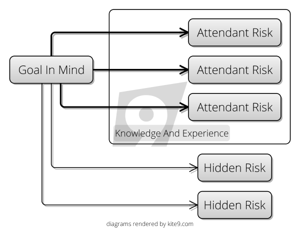
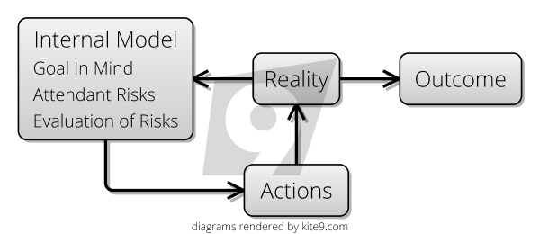

Hi.  

Welcome to the Risk-First Wiki.  

I've started this website because, on my career journey, I've noticed that the way I do things doesn't seem to match up with the way the books _say_ it should be done.  And, I found this odd and wanted to explore it further.   Hopefully, you, the reader, will find something of use in this.  

First up, I'm going to introduce a simple model for thinking about risk.

## A Simple Scenario

Lets for a moment forget about software completely, and think about _any endeavor at all_ in life.  It could be passing a test, mowing the lawn or going on holiday.  Choose something now.   I'll discuss from the point of view of "cooking a meal for some friends", but you can play along with your own example.  

### Goal In Mind

Now, in this endeavour, we want to be successful.  That is to say, we have a [Goal In Mind](Goal-In-Mind):  we want our friends to go home satisfied after a decent meal, and not to feel hungry.   As a bonus, we might also want to spend time talking with them before and during the meal.  So, now to achieve our [Goal In Mind](Goal-In-Mind) we *probably* have to do some tasks.  

If we do nothing, our friends will turn up and maybe there's nothing in the house for them to eat.   Or maybe, the thing that you're going to cook is going to take hours and they'll have to sit around and wait for you to cook it and they'll leave before it's ready.  Maybe you'll be some ingredients short, or maybe you're not confident of the steps to prepare the meal and you're worried about messing it all up.  

### Attendant Risk

These _nagging doubts_ that are going through your head I'll call the [Attendant Risks](Attendant-Risk):  they're the ones that will occur to you as you start to think about what will happen. 

When we go about preparing this wonderful evening, we can with these risks and try to mitigate them:  shop for the ingredients in advance, prepare parts of the meal, maybe practice the cooking in advance.  Or, we can wing it, and sometimes we'll get lucky.

How much effort we expend on mitigating [Attendant Risks](Attendant-Risk) depends on how great we think they are: for example, if you know it's a 24-hour shop, you'll probably not worry too much about getting the ingredients well in advance (although, the shop _could still be closed_).

### Hidden Risks

There are also hidden [Attendant Risks](Attendant-Risk) that you might not know about: if you're poaching eggs for dinner, you might know that fresh eggs poach best.    These are the "Unknown Unknowns" of [Rumsfeld's model](https://en.wikipedia.org/wiki/There_are_known_knowns).

Different people will evaluate the risks differently.  (That is, worry about them more or less.)  They'll also _know_ about different risks.  They might have cooked the recipe before, or organised lots more dinner parties than you.   

How we evaluate the risks, and which ones we know about depends on our **knowledge** and **experience**, then.  And that varies from person to person (or team to team).  Lets call this our [Internal Model](Internal-Model), and it's something we build on and improve with experience (of organising dinner parties, amongst everything else).

### Model Meets Reality

As the dinner party gets closer, we make our preparations, and the inadequacies of the [Internal Model](Internal-Model) become apparent, and we learn what we didn't know.  The [Hidden Risks](Attendant-Risk) reveal themselves; things we were worried about may not materialise, things we thought would be minor risks turn out to be greater.   

Our model is forced into contact with reality, and the model changes.  

If we had a good model, and took the right actions, we should see positive consequences.  If we failed to mitigate risks, or took inappropriate actions, we'll probably see negative actions.

## On To Software

In this website, we're going to look at the risks in the software process and how these are mitigated by the various methodologies you can choose from.  

Let's examine the scenario of a new software project, and expand on the simple model being outlined above:  instead of a single person, we are likely to have a team, and our model will not just exist in our heads, but in the code we write.  

On to [Software Project Scenario](Software-Project-Scenario)